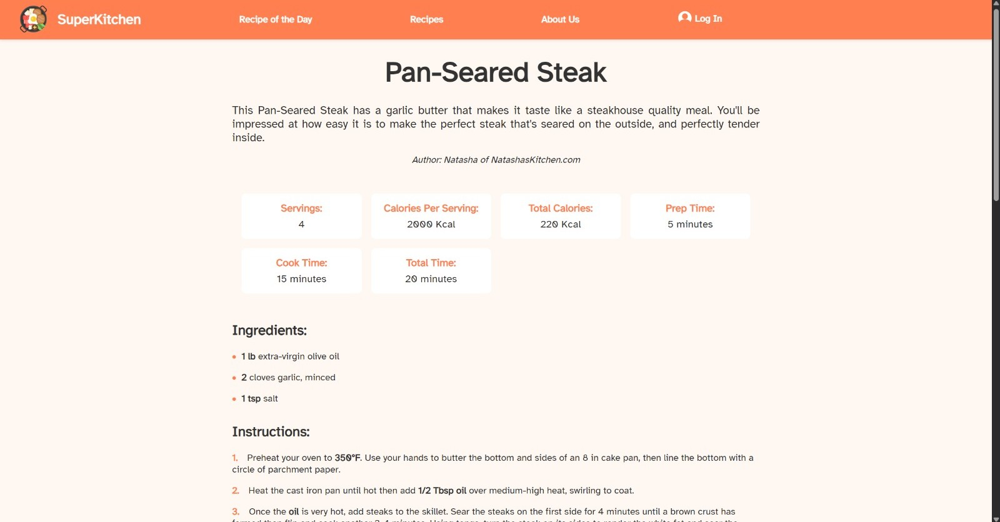

# Evidencia 2. Reconoce y procesa en paralelo



## 📖 Descripción

Sistema de procesamiento de recetas de cocina desarrollado en Clojure que permite transformar recetas en texto plano aplicando conversiones automáticas de unidades, escalado de porciones, transformaciones de temperatura y filtrado por categorías. El sistema genera archivos HTML estilizados como salida final.

### 🎯 Características Principales

- **Procesamiento paralelo y secuencial** de múltiples recetas
- **Conversión automática** entre sistemas métrico e imperial
- **Escalado inteligente** de porciones con fracciones mixtas
- **Transformación de temperaturas** (Celsius ↔ Fahrenheit)
- **Filtrado por categorías** (postres, platos principales, etc.)
- **Generación HTML** con estilos CSS integrados
- **Análisis de rendimiento** comparativo entre ejecuciones

## 🏗️ Arquitectura del Sistema

```
├── src/                      # Codigo Principal
│   ├── parsers.clj           # Motor de análisis y estructuras de datos
│   ├── parsers_input.clj     # Procesamiento de archivos de configuración
│   ├── convert.clj           # Sistema de conversiones y transformaciones
│   ├── create_html.clj       # Generación de archivos HTML
│   ├── create_styles.clj     # Sistema de estilos CSS
│   └── paralelo.clj          # Versión paralela del procesador
│   
├── recipe_collection/        # Archivos .txt de recetas
├── input_testing/           # Archivos de configuración
├── results/                 # Archivos HTML generados
├── main_noparalel.clj    # Versión secuencial para comparación
└── README.md
```

## ⚙️ Opciones de Configuración

| Parámetro | Valores | Descripción |
|-----------|---------|-------------|
| `sistema` | `metric`, `cup` | Sistema de unidades de medida |
| `temp` | `C`, `F` | Unidad de temperatura |
| `porciones` | Número entero | Cantidad deseada de porciones |
| `filtra` | `all`, `dessert`, `side-dish` | Filtro por categoría |

## 📊 Análisis de Rendimiento

El sistema incluye medición automática de tiempos de ejecución:

### Resultados Típicos (100 recetas)
- **Versión Secuencial:** ~13.8 segundos
- **Versión Paralela:** ~1.3 segundos
- **Speed-up:** 10.6x
- **Eficiencia:** 33%

## 🎨 Salida HTML

El sistema genera archivos HTML con:
- **Navegación estilizada** con branding SuperKitchen
- **Información nutricional** calculada automáticamente
- **Ingredientes formateados** con cantidades convertidas
- **Instrucciones numeradas** con temperaturas convertidas
- **Diseño responsivo** con CSS integrado

## 🧪 Testing

### Casos de Prueba Incluidos
- Conversión de fracciones mixtas
- Escalado de porciones
- Transformación de temperaturas
- Filtrado por categorías
- Manejo de ingredientes especiales

### Ejecutar Pruebas
```bash
# Ejecutar con archivo de prueba
clojure -M paralelo.clj
```

## 🤝 Contribuciones

### Desarrolladores

| Colaborador | Responsabilidades |
|-------------|------------------|
| **Dana Elizabeth Torres Estrada** | Motor de análisis (`parsers.clj`), generación HTML, estilos CSS, versión paralela |
| **Alejandro Uribe Moreno** | Sistema de conversiones (`convert.clj`), versión secuencial, análisis de rendimiento |

## 🚧 Trabajo Futuro

### Mejoras Planificadas
- [ ] Soporte para más unidades de medida
- [ ] Conversiones contextuales avanzadas
- [ ] Base de datos de ingredientes expandida

### Limitaciones Conocidas
- Algunas conversiones de especias requieren refinamiento
- Limpieza de descripciones puede ser inconsistente
- Dependencia de formato específico de archivos de entrada

## 📞 Contacto

- **Repositorio:** [GitHub](https://github.com/BlueE-05/MetodosComputacionales_Ev2)
- **Curso:** TC2037 - Implementación de métodos computacionales
- **Institución:** Tecnológico de Monterrey, Campus Monterrey

---

**Desarrollado con ❤️ usando Clojure y programación funcional**
